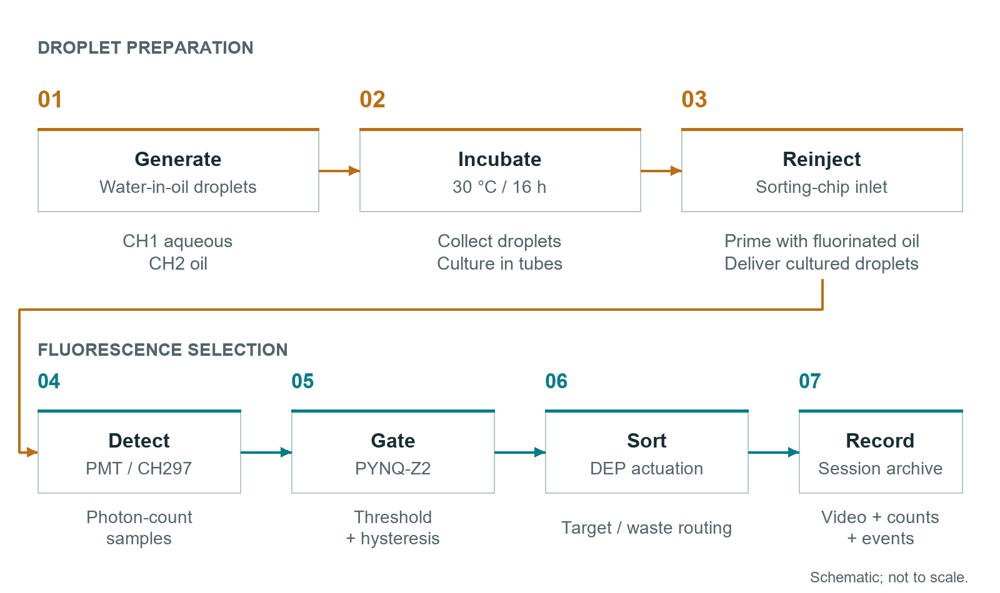

# System Architecture

NEFU-China Open Microfluidic Platform integrates droplet generation, incubation, reinjection, fluorescence measurement, and dielectrophoretic sorting in one documented workflow. The control application coordinates devices and preserves a synchronized record of each session.


## Modules

| Module | Equipment | Role | Reference settings |
| --- | --- | --- | --- |
| Fluidics | LSP02-3B pump, syringes, Tygon and PEEK tubing, stainless-steel capillaries | Two-phase delivery and reinjection | Aqueous: about 1.5 uL/min; oil: 500 uL over 28.5 min |
| Incubation | Collection tubes and incubator | Build fluorescence signal within droplets | 30 deg C for 16 h |
| Optical assembly | 488 nm excitation, observation LED, dichroic mirrors, emission and ND filters | Excite fluorescence while maintaining chip observation | eGFP optical configuration; observation illumination near 700 nm |
| Photon counting | H10682 head and CH297 | Convert fluorescence into count samples | 19200,n,8,1; configurable acquisition gate |
| Decision and gate | PYNQ-Z2 | Threshold and hysteresis logic with physical gate output | TCP 5000; PMOD B Pin 1; 0-3.3 V |
| DEP drive | DG1022Z and ATA-2081 | Apply the sorting field when gated | 8 kHz sinusoid; reference output 300-500 Vpp |
| Imaging and records | MUS40M-G camera and Windows control application | Observe droplets and record synchronized data | 30 fps recording default |

## Detection and Actuation

```text
Fluorescent droplet
  -> excitation and collection optics
  -> H10682 photon-counting head
  -> CH297 photon counter
  -> PC sample acquisition and forwarding
  -> PYNQ threshold and hysteresis decision
  -> PMOD B Pin 1 gate
  -> DG1022Z external trigger
  -> ATA-2081 amplifier
  -> DEP electrodes
  -> collection or waste outlet
```

The camera records the chip in parallel. PYNQ performs the gate decision from forwarded count samples. The physical output is the signal measured at PMOD B Pin 1; software status and video provide the corresponding experiment record.

## Fluidic Workflow



1. Generate water-in-oil droplets in the generation chip.
2. Collect the droplets and incubate at 30 deg C for 16 h for the reference workflow.
3. Prefill a syringe with a small volume of fluorinated oil, load the incubated droplets, and connect the sorting chip.
4. Establish stable reinjection and droplet spacing at the detection region.
5. Acquire fluorescence counts, configure the threshold, and enable gated DEP sorting.

The two channels of one LSP02-3B pump drive the aqueous and oil phases. The reference oil-to-water flow ratio is approximately 12:1. The same pump supports reinjection after incubation. Set the syringe diameter and volume/time parameters for each channel before operation, and use the software's channel verification controls before starting motion.

## Optical Separation


The eGFP configuration uses 488 nm excitation. A dichroic element separates excitation from returning fluorescence, and an emission filter selects the signal delivered to the PMT. Observation illumination near 700 nm enters from above the chip. An ND filter controls camera exposure. Select the complete emission-filter set for the installed optical path: the BOM includes FBH520-40 and a documented 535 nm configuration.

The modular optical assembly supports fluorophore-specific source and filter selection. The mCherry component options in the BOM describe excitation near 587 nm and emission filtering near 610 nm. Select the complete matched optical path for the fluorophore in use.

## Threshold Control

In AUTO mode, counts greater than or equal to `T_on` set the gate HIGH; counts less than or equal to `T_on - H` return it LOW. `H` is the hysteresis width. The V7 example configuration uses `T_on = 15000 counts` and `H = 100 counts`.

The manual pulse command supports commissioning with a specified width from 1 to 5000 ms. AUTO uses threshold and hysteresis; the V7 PERF service does not expose the earlier R2 automatic pulse-delay settings.

Calibrate these parameters using the active acquisition gate, baseline, and reference samples. Background-subtracted event amplitudes in the example analysis use a different measurement definition from the live raw-count threshold.

## Session Records

```text
recordings/<timestamp>_<experiment>/
  *_part001.avi                 Raw grayscale recording
  *_overlay_part001.avi         Recording with device-state annotations
  frame_index.csv              Frame-by-frame synchronization
  recording_metadata.txt       Acquisition metadata
  experiment_parameters.json   Parameter snapshot

perf_logs/pynq_ack_<session>.csv
perf_logs/communication_summary_<session>.txt
ch297_logs/CH297_V63_*.csv
sync_logs/CH297_SYNC_RECEIVE_V6_*.csv
control_logs/*.log
```

The frame index includes detector and gate fields. Compare the frame's indexed sample with the received-count stream and per-sample ACK record.

## Timing and Calibration

Measure droplet transit between the optical detection and electrode regions. Acquisition-window duration, sample transport, droplet spacing and field duration all contribute to the operating rate. Verify the assembled system with the selected chip and assay.

Use the V7 PERF acknowledgement logs for the current software's sequence and timing measurements. Establish sorting performance from observed trajectories and collected fractions for the active sample.
