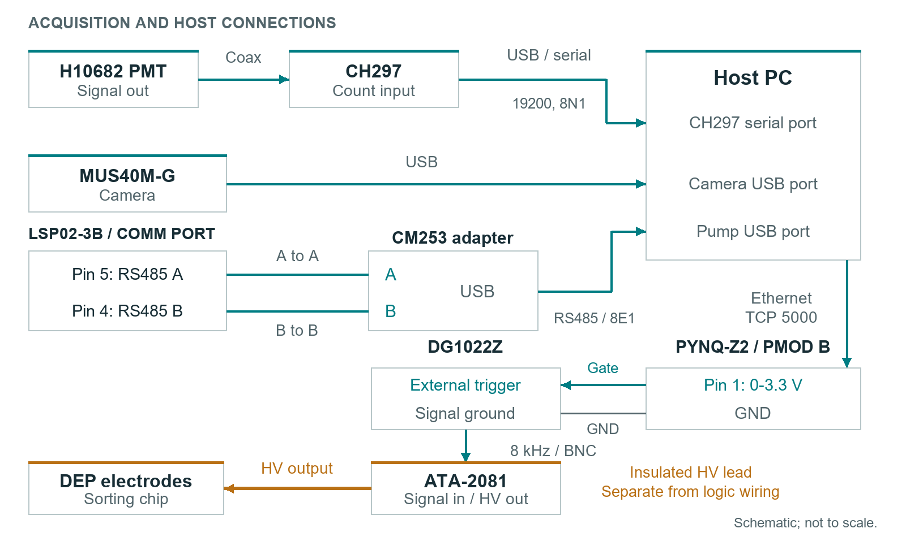

# Wiring and Commissioning

Use the connection table to assemble the platform, then commission the low-voltage gate before connecting the DEP drive. Route optical, fluidic, logic, and high-voltage connections so each can be inspected and serviced independently.

## Connections

| ID | Source | Destination | Interface | Assembly requirement |
| --- | --- | --- | --- | --- |
| 1 | H10682 signal output | CH297 input | Coaxial signal cable | Match the installed connectors and termination requirements |
| 2 | CH297 | PC | USB / virtual serial port | Reference assignment: COM10 |
| 3 | MUS40M-G | PC | USB | Install the camera driver and `OEApi64.dll` |
| 4 | LSP02-3B | USB-RS485 adapter | RS485 A, B and reference ground | Use an isolated adapter; reference assignment: COM9 |
| 5 | PYNQ-Z2 | PC | Ethernet | Reference address: `192.168.2.99:5000` |
| 6 | PMOD B Pin 1 | DG1022Z external trigger | 0-3.3 V logic gate | Never apply 5 V to the PYNQ output |
| 7 | PMOD B GND | Trigger-signal reference | Low-voltage ground | Verify equipment grounding before connection |
| 8 | DG1022Z output | ATA-2081 input | BNC coaxial cable | Reference waveform: 8 kHz sine |
| 9 | ATA-2081 high-voltage output | Sorting electrodes | Insulated high-voltage leads | Enclose exposed connections and disable output during wiring |
| 10 | Pump channel 1 | Aqueous syringe | Mechanical clamp | Set actual syringe dimensions and verified flow parameters |
| 11 | Pump channel 2 | Oil syringe | Mechanical clamp | Reference oil delivery: 500 uL over 28.5 min |
| 12 | Syringes | Chip inlet ports | Tygon / PEEK tubing and capillaries | Prime connections and clear bubbles before operation |

On the pump communication connector, pin 3 is signal ground, pin 4 is RS485(B), and pin 5 is RS485(A). Connect adapter A to pin 5, B to pin 4, and reference ground to pin 3. Check the connector orientation against the installed pump manual.

## Communication Settings

| Device | Reference port | Settings |
| --- | --- | --- |
| CH297 | Select the installed port | `19200,n,8,1`; V7 example gate 100 ms; set 10 ms for the PERF sequence |
| LSP02-3B | Select the installed port | Match the pump baud rate; V7 example uses `2400,Even,8,1`, address 1 |
| PYNQ-Z2 | `192.168.2.99:5000` | TCP / JSON Lines; `PYNQ_PERF_V1` samples, `PYNQ_ACK_V1` acknowledgements |

Serial port names depend on the workstation. Identify each connected device before entering its port. The pump device address stays at 1 when switching channels; the command payload selects the channel.

V7 PERF uses PMOD B pin 2 for RX_MARK. For processing-interval measurement, connect scope CH1 to RX_MARK and CH2 to GATE, with the corresponding low-voltage ground. RX_MARK begins after JSON and parameter processing.

## Low-Voltage Commissioning

1. Power PYNQ, establish Ethernet communication, and confirm that its service is listening on port 5000.
2. Keep the function generator, amplifier, and DEP electrodes disconnected. Connect PMOD B Pin 1 to oscilloscope CH1 and PMOD ground to the low-voltage reference. Start with DC coupling, 1 Mohm input, 1 V/div, and 20 ms/div; adjust the time base to capture the full pulse.
3. Send a 1000 ms test pulse. Confirm an approximately 3.3 V plateau lasting 1000 ms and the matching LED0 indication.
4. Send force LOW and confirm that the output returns to 0 V.
5. Connect the PMT and CH297. Complete light shielding, acquire dark counts, and then enable the excitation source with the emission filter installed.
6. Commission the pump with the chip disconnected and a conservative flow setting. Read and verify the parameters for the selected channel. Keep any uncommissioned channel disabled until its command response and mechanical motion have been verified.
7. Connect the function generator and confirm its externally gated waveform at low voltage.
8. With the amplifier output disabled, connect the insulated DEP leads. Confirm the waveform at the amplifier monitor port before enabling the operating field.

## Electrical and Optical Operation

PYNQ PMOD signals are 3.3 V logic. Use the gate as a trigger signal, with the function generator and amplifier supplying the electrode drive. Keep high-voltage wiring physically separated from logic and fluidic connections.

Complete shielding before powering the PMT. Protect its glass window from pressure and prevent intense illumination while powered. If counts rise unexpectedly, disable excitation and PMT power before inspecting the optical path.

Stop the pump and disable the amplifier before changing tubing or electrodes. Close the control application through its normal shutdown sequence so recordings and session metadata finish writing.
