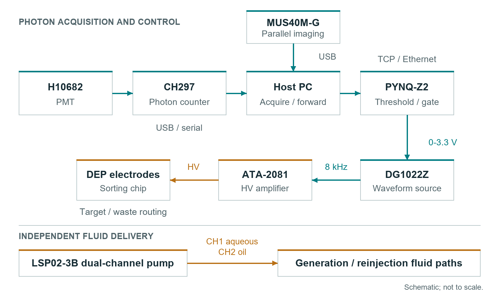
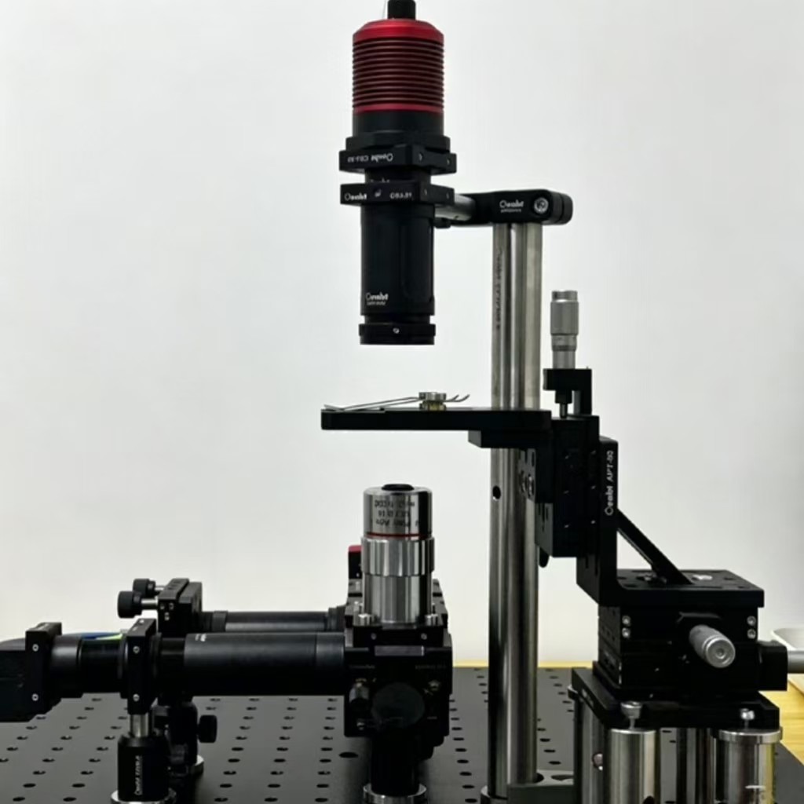
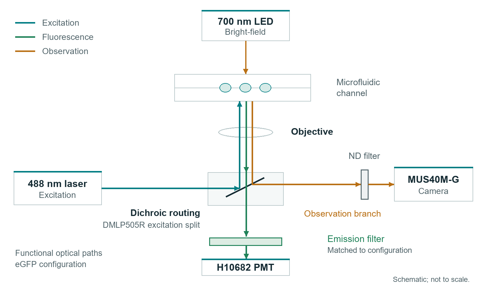
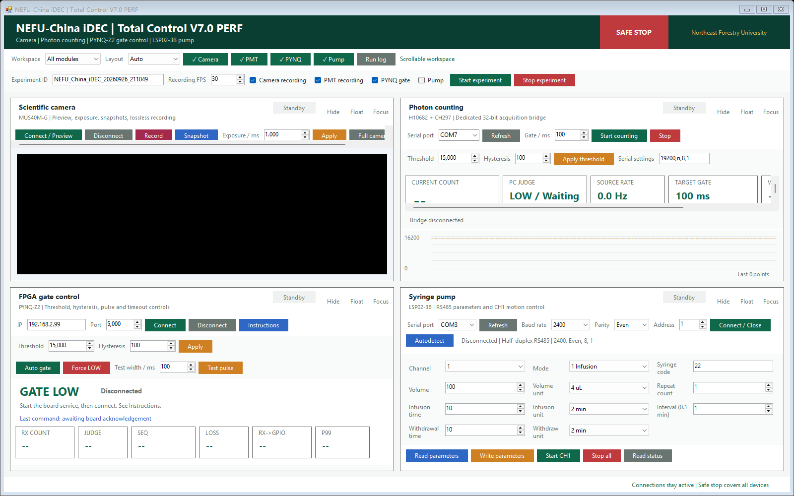

# NEFU China Open Microfluidic Platform

## Microfluidic Platform Build Guide

Edition 0.8.2 | September 2026

## 01 Build the platform

This guide takes a new builder from component selection to operating the NEFU-China microfluidic platform. Assemble the fluidic and optical paths, connect the instrument chain, install Total Control V7.0 PERF and bring each module online before enabling the DEP drive.



### Assembly order

1. Select components and arrange the bench using sections 02 to 04.
2. Assemble the optical path and low-voltage connections using sections 05 and 06. Keep excitation and the high-voltage drive disabled.
3. Install the Windows and PYNQ software using sections 07 and 08.
4. Connect one module at a time, then check the gate and DEP drive using sections 09 and 10.
5. Operate from the V7 workspace using sections 11 and 12. Use sections 13 and 14 for fault recovery and shutdown.

Use Hardware/BOM.xlsx to select components and Hardware/Device_Specs.md for equipment limits. Hardware/Wiring_Diagram.md provides the connection reference. Component ratings and connector orientation must match the installed instruments.

## 02 Parts and tools

| Assembly | Prepare | Check before assembly |
| --- | --- | --- |
| Fluid delivery | LSP02-3B; syringes; Tygon and PEEK tubing; capillary adapters; collection tubes | Syringe dimensions, chip port fit and fluid compatibility |
| Chip and mount | Generation and sorting chips; chip holder; optical base and cage hardware | Accessible inlets, outlets, detection region and electrodes |
| Optics | Excitation source; objective; dichroic; emission filters; observation LED; shielding | Matched excitation and emission bands; clear apertures |
| Detection | H10682; CH297; coaxial signal lead; supplier power and USB cables | PMT model suffix and matching calibration file |
| Imaging | MUS40M-G; USB; OsCam driver and complete x64 SDK | Camera recognized by the supplier software |
| Control | 64-bit Windows PC; PYNQ-Z2 and microSD image; Ethernet; isolated USB-RS485 adapter | .NET Framework 4.8 or 4.8.1; PYNQ BaseOverlay |
| DEP drive | DG1022Z; ATA-2081; BNC signal leads; insulated electrode leads | Correct trigger input; rated HV leads and guarded terminals |

### Tools at the bench

Prepare the drivers and hex keys required by the mounts, a tubing cutter, compatible cleaning supplies, labels, a multimeter and an oscilloscope. Use low-voltage probes for PMOD signals and the amplifier's documented monitor connection or a correctly rated high-voltage probe for the DEP output.

### Assembly conditions

Keep fluids below and away from electronics. Secure mounts and strain relief, and keep power switches accessible. Follow the laboratory's laser procedure with wavelength-appropriate protection and beam control. Enclose high-voltage connections and handle them only with the drive disabled and discharged.

## 03 Bench and fluid connections



Secure the base and chip holder. Keep both pump pushrods visible and support tubing without tension at the chip. Place waste where its tubing cannot pull on the fittings. Route PMT and PYNQ signals separately from the amplifier output; keep the laser and drive disabled.

### Connect the fluid path

1. Identify the chip's aqueous inlet, oil inlet and outlet from its port map. For the sorting chip, identify the reinjection, collection and waste paths as well.
2. Secure the syringes in the LSP02-3B clamps. Seat each barrel and bring the pushrod into contact with its plunger without forcing fluid into the chip.
3. Connect the oil syringe through compatible Tygon tubing. Fit PEEK tubing or capillary adapters to the remaining ports as required. Match the actual port and connector sizes; never force an oversized fitting.
4. Label the aqueous and oil lines at both ends. In the reference arrangement, channel 1 supplies aqueous phase and channel 2 supplies oil.
5. Route the outlets to their containers and check every junction. Enter the actual syringe dimensions in the pump before running either channel.

### Ready to continue

The chip is held flat, the camera view can include the channel and sorting junction, tubing does not load the ports mechanically, and both plungers have sufficient travel for the intended operation.

## 04 Prime and establish droplets

1. Prepare the aqueous sample and compatible oil formulation for the chip and assay. Fill the syringes and lines without visible air, using the validated formulation associated with that chip.
2. With the tubing outlet in waste, use the pump front panel to prime each line at a conservative setting. Stop before attaching the primed lines to the chip.
3. Reconnect without introducing bubbles. Start oil and aqueous delivery under camera or microscope observation. Inspect fittings and chip bonds for leakage.
4. Adjust one flow setting at a time until there is a continuous train of separated droplets. Stop for blockage, leakage or abrupt pressure changes; do not force a blocked chip.

| Reference setting | Value | Use |
| --- | --- | --- |
| Aqueous delivery | 1.5 uL/min | Reference for the documented generation setup |
| Oil delivery | 500 uL in 28.5 min | Approximately 17.5 uL/min |
| Droplet diameter | Approximately 30 um | Measure on the installed chip and adjust phase flows |
| Reference incubation | 30 deg C for 16 h | Apply to the matching biological workflow |

### Reinject incubated droplets

Collect droplets in a compatible tube and apply the assay's incubation conditions. Prefill the reinjection syringe with a small volume of compatible fluorinated oil, gently load the emulsion and prime the connection to the sorting chip. Start slowly and adjust spacing while watching the detection region. Keep collection and waste outlets separate.

### Expected observation

Droplets are separated, similar in size and moving through the intended channel without visible air, leakage or persistent merging. If they merge during reinjection, stop and check the formulation, loading method and flow setting before resuming.

## 05 Install the optical path



1. Keep the laser disabled and the PMT unpowered and covered. Secure the excitation, objective, dichroic, filter, camera and detector mounts before alignment.
2. Fit the source and filters as a matched set. The eGFP reference uses 488 nm excitation, a DMLP505R dichroic and an FBH520-40 emission component. Preserve the full filter stack for the selected path.
3. Focus the camera on the interrogation region using observation illumination. The reference arrangement uses illumination near 700 nm and an ND element in the camera path.
4. Follow the laboratory laser-alignment procedure at the lowest practical illumination. Place the interrogation spot across the droplet path, use suitable beam-control equipment and never look into the optical axis.
5. Install the emission-filtered PMT path and close the shielding. Complete detector connections before applying PMT power.

### Confirm the separation

After section 09 brings the counter online, check the shielded dark level, background with the selected illumination and signal from the intended fluorescent sample. The camera should resolve the channel while observation illumination remains controlled at the PMT. Disable excitation and PMT power before investigating unexpectedly high counts.

For another fluorophore, select a matched source, dichroic and emission-filter set. The BOM includes mCherry options near 587 nm excitation and 610 nm emission; the eGFP values are not a universal configuration.

## 06 Electrical connections

| From | To | Connection |
| --- | --- | --- |
| H10682 signal output | CH297 input | Coaxial signal lead; match detector termination requirements |
| CH297 | Windows PC | USB; supplier driver exposes the COM port |
| MUS40M-G | Windows PC | USB; supplier camera driver |
| LSP02-3B pin 5 | RS485 adapter A | Pump communication connector |
| LSP02-3B pin 4 | RS485 adapter B | Pump communication connector |
| LSP02-3B pin 3 | Adapter reference ground | Check connector viewing orientation in the pump manual |
| PYNQ Ethernet | PC or laboratory switch | Same reachable IP subnet |
| PMOD B pin 1 | DG1022Z external trigger | GATE; 0 or 3.3 V logic |
| PMOD B pin 5 or 11 | Trigger reference ground | Low-voltage signal reference |
| DG1022Z output | ATA-2081 input | BNC cable; configure before enabling output |
| ATA-2081 HV output | Sorting electrodes | Rated leads and guarded contacts; drive disabled while wiring |

### Power and grounding

Use each instrument's specified supply and the PYNQ board's documented power-source selection. The H10682 requires its specified +5 V supply and completed light shielding. Verify protective earth and signal references against the instrument manuals. Never connect a high-voltage electrode or 5 V signal to a PMOD pin.

### Scope access

For initial checks, connect PMOD B pin 1 to a low-voltage scope input instead of the generator. Pin 2 is RX_MARK, an optional V7 processing marker. Use pin 5 or 11 as the low-voltage reference. Keep scope ground clips away from the high-voltage output.

## 07 Install the Windows tools

1. Extract the Windows release into a writable folder. Open Software/PC_Control/TotalControl_V7_0 and keep its directory structure intact. The main application is x64; the CH297 bridge is x86.
2. Install .NET Framework 4.8 or 4.8.1 and the complete x64 OsCam SDK and driver. Confirm the camera opens in OsCam, then close OsCam before connecting from Total Control.
3. Install the CH297 driver. Obtain the matching PMTCount.dll and instrument-specific para.ini from the supplier package, and place them under runtime/ch297 beside the bridge EXE. Retain the supplied detector calibration values.
4. Complete the supplier's x86 COM registration. If PMTCount.PMTCounter is not registered, run 05_REGISTER_CH297_DLL_ADMIN.cmd as Administrator and confirm its prompt. It invokes the 32-bit Windows registration tool.
5. Run 04_CHECK_ENVIRONMENT.cmd. Complete its installation actions and rerun the check. It reads files and registration without connecting instruments.
6. Run 06_LIST_SERIAL_DEVICES.cmd and identify the CH297 and USB-RS485 ports. Launch 02_RUN_TOTAL_CONTROL_V7_0.cmd. Enter the actual ports in the corresponding modules.

### Camera SDK in a custom folder

The application searches NEFU_OSCAM_DIR, standard OsCam folders and its own folder. For a custom SDK location, set NEFU_OSCAM_DIR to the absolute folder containing OEApi64.dll and its complete matching dependency set, then restart Total Control.

### Build the same program from source

```bat
00_BUILD_TOTAL_CONTROL_V7_0_PERF.cmd --no-pause
```

The build produces the main EXE and runtime/ch297/NEFU_CH297_Bridge_V6_3_x86.exe. NEFU_China_iDEC_V7.sln provides the equivalent Visual Studio projects; BUILDING.md lists prerequisites. Supplier SDKs are installed separately.

## 08 Start the PYNQ service

### Prepare the board and network

1. Prepare a microSD card with a PYNQ-Z2 image providing Python 3.7 or later, pynq and BaseOverlay with base.bit. Select boot and power settings according to the image and board manual, then boot the board.
2. Connect Ethernet and identify the board address. Put the PC on the same reachable subnet. The reference board address is 192.168.2.99; on an isolated 192.168.2.0/24 link, an unused PC address such as 192.168.2.10 with mask 255.255.255.0 is suitable. Avoid address conflicts.
3. Open the board's Jupyter interface using the image's documented address and credentials. Create NEFU_iDEC under jupyter_notebooks and upload Software/PYNQ/pynq_v6_perf_server.py.
4. Keep the amplifier disabled. Stop any previous gate server normally so only one process owns TCP port 5000.

### Run in a board terminal

```bash
cd /home/xilinx/jupyter_notebooks/NEFU_iDEC
python3 pynq_v6_perf_server.py
```

Keep the terminal open. Successful startup prints Listening on 0.0.0.0:5000. Enter the actual board address and port 5000 in the Windows PYNQ module, then select Connect. The gate starts LOW and LED0 is off.

### Service operation

This service uses PYNQ_PERF_V1 samples and PYNQ_ACK_V1 acknowledgements. It loads the standard BaseOverlay; no custom project bitstream is required. Keep the control link on a trusted laboratory network.

To stop, request Force LOW from Windows, disable the amplifier and use Ctrl+C in the board terminal. If port 5000 is occupied, close the previous server normally before restarting. Where the earlier nefu-idec-gate.service was installed, stop it with sudo systemctl stop nefu-idec-gate.service.

## 09 Connect each device

### Camera

Select Connect / Preview in the camera module. Focus on the channel and set exposure so droplet boundaries remain clear, then select Apply. Full camera panel opens the remaining controls. Expected observation: a live channel image responding to focus and illumination changes.

### Photon counter

1. Complete PMT shielding and power connections. Close the supplier application and old bridge consoles so the COM port is free.
2. Select the actual CH297 port, 19200,n,8,1 and an acquisition gate in multiples of 10 ms. The distributed example is 100 ms.
3. Select Start counting. Total Control starts its x86 bridge. Confirm valid counts and the sample counter update, not just a connected label. Run only one workstation and bridge.
4. Compare the shielded dark level, background and intended fluorescent sample at the same gate duration. Set Threshold and Hysteresis for that condition and select Apply threshold.

### PYNQ

Enter the running board's address and select Connect. Confirm GATE LOW and use Force LOW. Set the matching threshold and hysteresis, then select Apply. Leave Auto gate off until section 10's physical output check is complete.

### Syringe pump

Select the actual USB-RS485 port, the pump's configured baud rate, Even parity, 8 data bits, 1 stop bit and address 1. V7's example uses 2400 baud. Connect / Close opens a read-only handshake; Autodetect probes the selected port if its settings are unknown.

Select the channel and Read parameters before changing it. Match syringe code, volume, time and direction to the fitted syringe. After Write parameters, read them back. Start CH1 requests channel 1 motion after confirmation; verify the pushrod. Operate channel 2 from the pump front panel: V7 keeps CH2 remote motion locked. Stop all requests a pump stop.

## 10 Gate and DEP drive

### Check the low-voltage gate first

1. Leave the generator, amplifier and electrodes disconnected from the gate. Connect the scope to PMOD B pin 1 and the low-voltage reference. Use a high-impedance DC input and time base suited to the pulse.
2. With the board connected, confirm idle LOW. Set the manual pulse width to 1000 ms and select Test pulse. Expect an approximately 3.3 V plateau and LED0 indication, followed by LOW.
3. Select Force LOW and confirm 0 V. An invalid count stream or interrupted communication also returns LOW; use the normal stop controls to finish operation.

### Connect the generator and amplifier

1. With outputs disabled, connect GATE to the DG1022Z external trigger and connect their low-voltage reference. Select the external gate or trigger behavior required by the generator mode.
2. Configure an 8 kHz sine carrier. Observe the low-voltage generator output while issuing a manual gate command. Confirm that the mode produces the intended waveform and returns to its inactive state.
3. Disable outputs. Connect the generator to the ATA-2081 input and fit rated electrode leads with exposed contacts guarded. Confirm input impedance, load and grounding against the instrument manuals.
4. Use the amplifier's documented voltage-monitor connection or a correctly rated HV probe. Begin at low drive and increase only within chip and instrument ratings. The reference range of 300 to 500 Vpp at 8 kHz is an operating example, not an automatic starting value.

### Before switching to AUTO

Confirm stable flow, current valid counts and the correct detection region. Verify the generator mode and electrode response for the selected settings before enabling the drive. Force LOW controls the digital gate; manually disable and discharge the amplifier before touching fluid fittings or electrodes.

## 11 First integrated run



1. Enter an experiment identifier using letters, digits, underscores or hyphens. Select the required modules and recording options.
2. Keep the pump option unselected when managing two-phase delivery from the front panel. Selecting it requests CH1 motion; it does not start both channels.
3. Establish camera preview, stable flow and valid CH297 acquisition. Connect PYNQ and apply threshold and hysteresis. Confirm the safe initial state of the DEP drive.
4. For acquisition without actuation, leave PYNQ gating unselected. For a commissioned sorting run, enable the intended drive and select PYNQ gating. Start experiment starts the selected recording and enables the selected gate mode.
5. Watch droplets, counts and gate state. Adjust operating settings from a controlled LOW state. Use Stop experiment to finish normally or SAFE STOP for immediate software stop requests.

Observe trajectories at the junction to confirm the intended collection path. A HIGH label or changing count does not establish that a droplet reached collection. Keep the amplifier's hardware stop accessible.

## 12 Settings and saved files

| Setting | Reference | Use |
| --- | --- | --- |
| CH297 acquisition gate | 100 ms example | Choose a multiple of 10 ms. A different duration changes the count scale. |
| Threshold T | 15000 counts | Set for the current background and fluorescent sample at the selected gate. |
| Hysteresis H | 100 counts | AUTO sets HIGH at count >= T and LOW at count <= T - H. |
| Manual test pulse | 1 to 5000 ms | Commissioning command, distinct from AUTO threshold gating. |
| Pump connection | 2400,Even,8,1 | Match the pump setting; address remains 1 when changing channels. |
| PYNQ endpoint | 192.168.2.99:5000 | Use the installed board address. |
| Recording setting | 30 fps default | Choose for the camera setup; saved timestamps identify acquisition timing. |

### Recording output

Camera recordings are stored in recordings/NEFU_IDEC_<timestamp>_<experiment>/. The raw AVI contains the camera image; the optional review AVI adds device state. frame_index.csv links frames to acquisition state, and recording_metadata.txt stores recording settings. Stop recording normally and wait for writing to finish before moving files.

### Device diagnostics when needed

ch297_logs contains source acquisition records, sync_logs the workstation receive stream and perf_logs the V7 acknowledgements and summaries. Use the Run log panel first for connection faults. These files are generated during operation; no extra diagnostic run is required for routine setup.

The board drives LOW on startup, invalid samples and disconnect. In AUTO, valid-sample timeout is 1 second; client inactivity timeout is 3 seconds. Check the physical output and manually controlled amplifier state before handling hardware.

## 13 Troubleshooting

For a fluidic or electrical fault, request Force LOW, disable the amplifier and stop pump motion. Recover one subsystem at a time before resuming.

| Symptom | Check and recover |
| --- | --- |
| Camera not detected | Check USB and supplier drivers. Close OsCam or another camera application. Check OEApi64.dll and matching x64 dependencies; restart after changing NEFU_OSCAM_DIR. |
| PMTCount not registered | Install the supplier x86 component. Use the administrator helper for the matching PMTCount.dll, then rerun the environment check. |
| CH297 start returns -1 | Check power and actual COM port. Close supplier software, serial terminals and old bridges. Reconnect with 19200,n,8,1. |
| CH297 start returns -4 | Begin with a 10 ms or 100 ms gate. Use multiples of 10 ms within the counter's supported range. |
| Counts missing or invalid | Check PMT power, signal cable, serial settings and shielding. Keep GATE LOW. Read errors -1 and -2 mean checksum error and no received count. |
| Counts unexpectedly high | Disable excitation and PMT power before inspection. Check light leaks, emission filtering, illumination and matching para.ini. |
| PYNQ cannot connect | Check power, address, subnet and Ethernet. Confirm Listening on 0.0.0.0:5000 in its terminal. Run the matching PERF server. |
| Port 5000 occupied | Request LOW and disable the drive, then stop the previous board server normally before restarting. |
| Pump has no reply | Check RS485 A/B/reference, address 1, baud and Even parity. Close other serial tools. Use read-only Autodetect on the selected port. |
| No droplets or leakage | Stop the pump. Check syringe seating, air, bends, fittings and blockage. Replace damaged or leaking chips; do not raise pressure to clear them. |
| Gate changes without deflection | Return LOW and disable the drive. Check generator mode, monitored amplifier output, electrode contact, droplet size and alignment. |

## 14 Shutdown and care

### Finish the run

1. Select Stop experiment or Force LOW as appropriate. Confirm LOW, switch off the amplifier output and follow its discharge procedure.
2. Stop both pump channels and confirm pushrod motion has stopped before disconnecting tubing.
3. Stop counting and finish camera recording. Wait for writing to complete and retain the files needed for your work.
4. Disable excitation, switch off the PMT supply and cover the detector. Close the Windows application normally.
5. If shutting down PYNQ, stop the service with Ctrl+C and use the board operating system's normal shutdown before removing power.

### Clean and store

With the electrical drive isolated, dispose of sample and fluids under the laboratory procedure. Flush only with a solution compatible with chip material, bonding, tubing and fluid formulation. Use gentle flow into waste and stop for leakage or resistance. Do not force a blockage with pressure.

Replace damaged tubing and chips. Follow the chip supplier's storage procedure, cap clean fluid lines and protect optical faces from dust. Clean optics only by the supplier-approved method. Keep the PMT window covered and free from mechanical contact.

### Next startup

Inspect fittings, insulation and shielding. Confirm syringe dimensions and pump settings, then connect camera, photon counter, PYNQ and pump. Begin with the drive disabled and GATE LOW.

### Project reference

Hardware/BOM.xlsx lists parts; Hardware/Device_Specs.md and Hardware/Wiring_Diagram.md cover specifications and connections. Software/PC_Control/TotalControl_V7_0 contains the Windows program. Software/PYNQ contains the board service. Examples/Video/Droplet_Microscopy.mp4 shows the channel and droplets.
