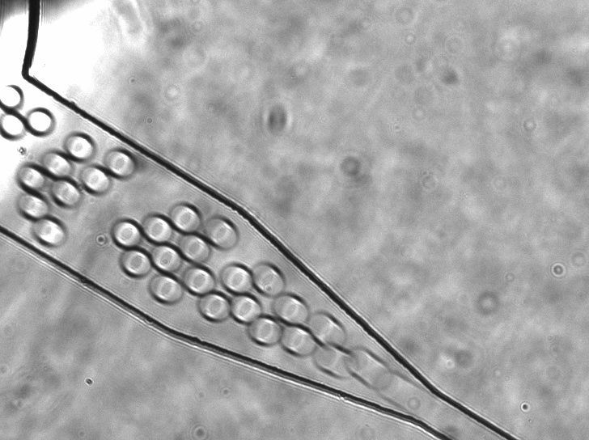

# NEFU China Open Microfluidic Platform

**Total Control V7.0 PERF**

An open workstation for camera observation, photon counting, programmable gating and fluid delivery.



[Build and Operation Guide](Manual/Build_and_Operation_Manual.pdf) · [Windows Setup](Software/PC_Control/TotalControl_V7_0/WINDOWS_RUNTIME.md) · [Hardware](Hardware/README.md) · [Microscopy Video](Examples/Video/Droplet_Microscopy.mp4)

## Download

Choose **`NEFU-China-Open-Microfluidic-Platform-0.8.1-windows-x64.zip`** for the complete project: prebuilt applications, all project source, Visual Studio solution, hardware documentation, guide and selected microscopy video.

The separate **`NEFU-China-Open-Microfluidic-Platform-0.8.1.zip`** contains the same project resources without compiled executables.

## Start

Extract the Windows package, open `Software/PC_Control/TotalControl_V7_0`, and run:

```bat
04_CHECK_ENVIRONMENT.cmd --no-pause
02_RUN_TOTAL_CONTROL_V7_0.cmd
```

The package includes the x64 workstation and x86 CH297 bridge. Install .NET Framework 4.8+ and the instrument vendors' camera/CH297 components before hardware commissioning.

## Build

```bat
00_BUILD_TOTAL_CONTROL_V7_0_PERF.cmd --no-pause
```

Alternatively, open [NEFU_China_iDEC_V7.sln](Software/PC_Control/TotalControl_V7_0/NEFU_China_iDEC_V7.sln). See [BUILDING.md](Software/PC_Control/TotalControl_V7_0/BUILDING.md).

## Connect

Deploy [the matching V7 PERF service](Software/PYNQ/README.md) to PYNQ-Z2. The PC sends `PYNQ_PERF_V1` samples and records `PYNQ_ACK_V1` acknowledgements. Use PMOD B pin 1 for GATE and pin 2 for RX_MARK timing measurements.

Keep the DEP amplifier disabled during digital commissioning. Follow the guide for optical alignment, fluid priming and measured output checks.

## Explore

| Directory | Contents |
| --- | --- |
| `Software/` | V7 workstation, acquisition bridge, PYNQ service and tests |
| `Manual/` | English PDF, editable Word and Markdown guide |
| `Hardware/` | BOM, specifications and editable engineering figures |
| `Examples/` | Selected droplet microscopy video |
| `scripts/` | Reproducible source and Windows packaging |

## Verify and Package

```bash
python -m unittest discover -s tests -v
python -m unittest discover -s Software/PYNQ/tests -p test_perf_server.py -v
python scripts/check_distribution.py
python scripts/build_release.py
python scripts/build_windows_release.py
```

See [VALIDATION.md](VALIDATION.md), [RELEASE_NOTES.md](RELEASE_NOTES.md) and [RELEASING.md](RELEASING.md).

## License

Software: [MIT](LICENSE). Project documentation, original diagrams and example media: [CC BY 4.0](LICENSE-DOCS). Vendor SDKs retain their own terms and are installed separately.

NEFU-China iDEC Experimental Group · Northeast Forestry University.
