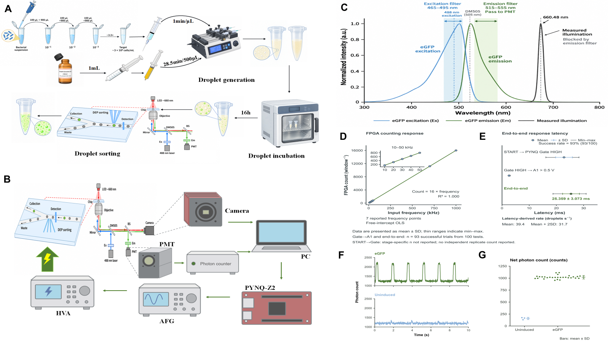
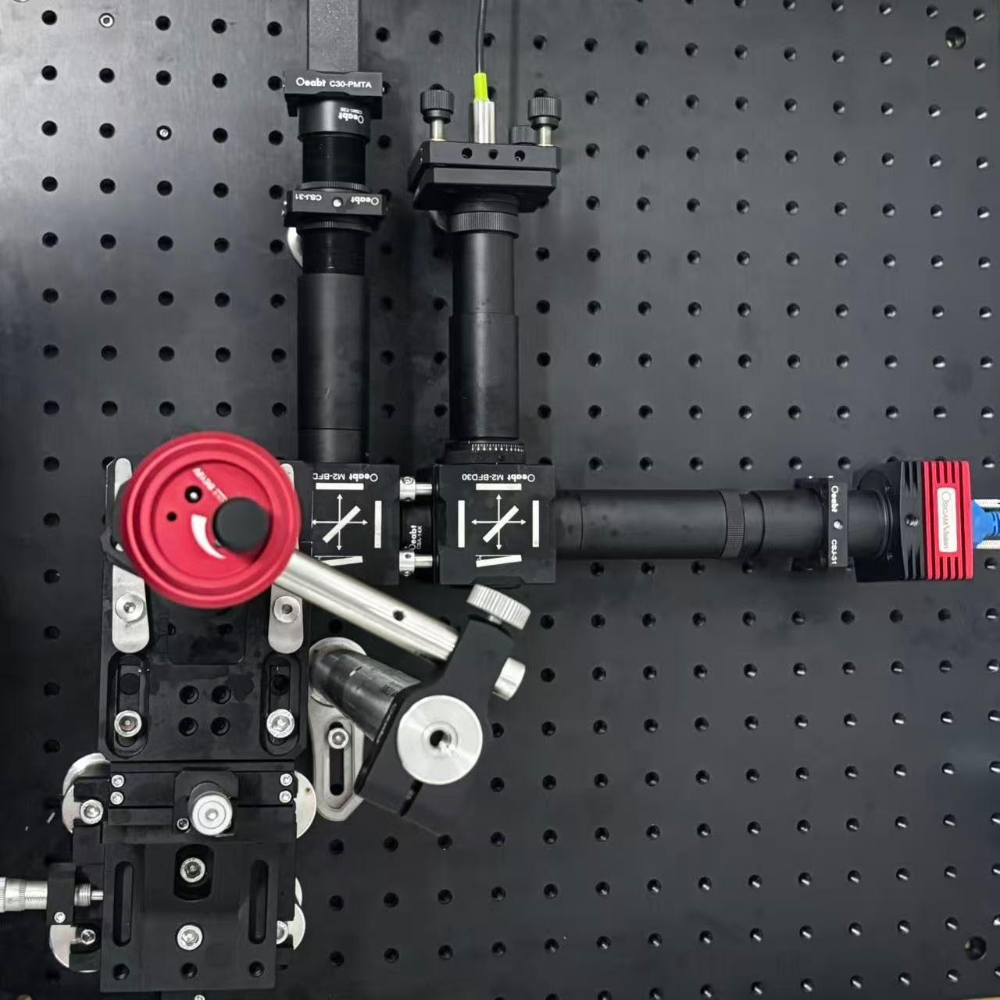
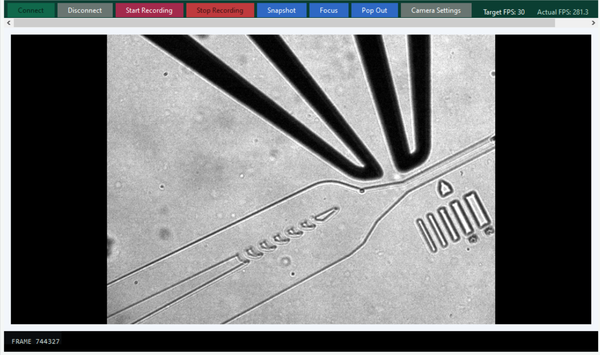
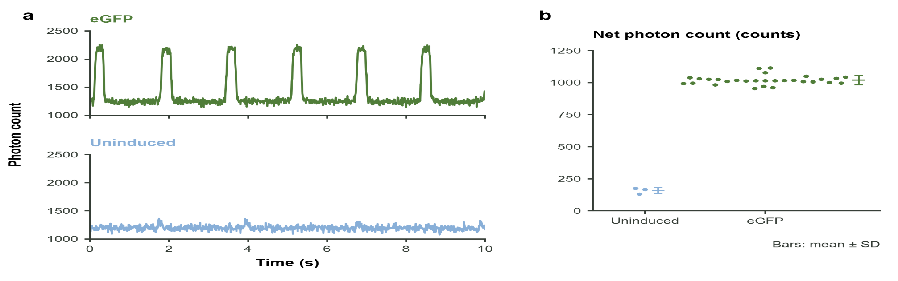
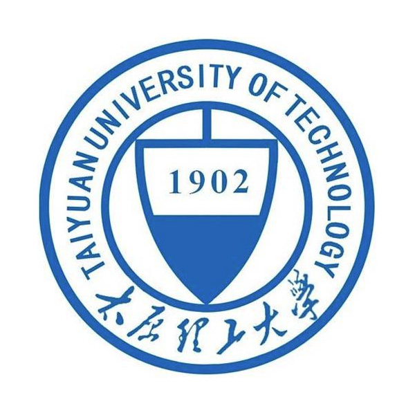

# NEFU-China Open Microfluidic Platform

An integrated experimental platform for droplet imaging, fluorescence photon counting, programmable gating and fluid delivery.

<p>
&nbsp;&nbsp;&nbsp;&nbsp;

</p>

**NEFU-China iDEC Experimental Group** | Northeast Forestry University

[**Windows Package 0.8.4**](https://github.com/YuanCheng-NEFU/NEFU-China-Open-Microfluidic-Platform/releases/download/v0.8.4/NEFU-China-Open-Microfluidic-Platform-0.8.4-windows-x64.zip) | [Build Guide](Manual/Build_Guide.pdf) | [Project Showcase](https://yuancheng-nefu.github.io/NEFU-China-Open-Microfluidic-Platform/) | [Release 0.8.4](https://github.com/YuanCheng-NEFU/NEFU-China-Open-Microfluidic-Platform/releases/tag/v0.8.4)



*Droplet preparation, optical detection and fluorescence-triggered actuation. Original overview from the NEFU-China iDEC presentation.*

## What We Built

The platform integrates fluidics, imaging, fluorescence detection and external DEP actuation. **Total Control V7.0 PERF** coordinates the instruments in one Windows workspace.

Droplet generation &rarr; fluorescence detection &rarr; photon counting &rarr; threshold decision &rarr; PYNQ gating &rarr; DEP sorting.

## System Overview

The PMT and CH297 acquire fluorescence counts. The workstation forwards samples to PYNQ-Z2, which controls the external gate of the DEP drive. Camera observation and syringe-driven fluid delivery run alongside the detection and actuation chain.

<table>
<tr>
<td width="50%"></td>
<td width="50%"></td>
</tr>
<tr><td>Imaging and fluorescence detection assembly</td><td>Optical breadboard and detection branches</td></tr>
</table>

[Hardware reference](Hardware/README.md) | [Bill of materials](Hardware/BOM.xlsx) | [Wiring](Hardware/Wiring_Diagram.md)

## Experimental Demonstration

[](Examples/Video/Droplet_Microscopy.mp4)

**[Watch droplet microscopy](https://yuancheng-nefu.github.io/NEFU-China-Open-Microfluidic-Platform/#demonstration)** | [Download MP4](https://raw.githubusercontent.com/YuanCheng-NEFU/NEFU-China-Open-Microfluidic-Platform/main/Examples/Video/Droplet_Microscopy.mp4) | 42.8 s / 728 x 544 / 10 fps



*Representative eGFP and uninduced measurements from the project presentation. The original plotted comparisons are retained.*

## Control Platform

The Windows workstation integrates camera observation, CH297 acquisition, PYNQ gate settings and syringe-pump operation.


## Core Capabilities

- **Programmable gating.** Threshold and hysteresis control, manual output commands and automatic LOW on data or connection timeout.
- **Coordinated operation.** Integrated start and stop, camera recording and CH1 pump operation.
- **Open engineering resources.** Buildable source, editable component inventory and documented optical, electrical and fluidic connections.

## Build the System

| Download | Contents |
| --- | --- |
| [**Windows package 0.8.4**](https://github.com/YuanCheng-NEFU/NEFU-China-Open-Microfluidic-Platform/releases/download/v0.8.4/NEFU-China-Open-Microfluidic-Platform-0.8.4-windows-x64.zip) | Workstation EXE, bridge EXE, source, guide, hardware references and example media |
| [Source package 0.8.4](https://github.com/YuanCheng-NEFU/NEFU-China-Open-Microfluidic-Platform/releases/download/v0.8.4/NEFU-China-Open-Microfluidic-Platform-0.8.4.zip) | Project resources for building from source |
| [Build Guide PDF](Manual/Build_Guide.pdf) | Assembly, installation, first operation and troubleshooting |

Follow the [Build Guide](Manual/Build_Guide.pdf) for optical assembly, chip and tubing setup, instrument wiring and digital commissioning. Install .NET Framework 4.8+ and the camera/CH297 vendor components using [Windows Setup](Software/PC_Control/TotalControl_V7_0/WINDOWS_RUNTIME.md). Deploy the matching [PYNQ service](Software/PYNQ/README.md).

Keep the DEP amplifier physically disabled during wiring and digital commissioning.

Extract the Windows package and open `Software/PC_Control/TotalControl_V7_0`:

```bat
04_CHECK_ENVIRONMENT.cmd --no-pause
02_RUN_TOTAL_CONTROL_V7_0.cmd
```

To compile from source, run `00_BUILD_TOTAL_CONTROL_V7_0_PERF.cmd --no-pause` or open [NEFU_China_iDEC_V7.sln](Software/PC_Control/TotalControl_V7_0/NEFU_China_iDEC_V7.sln). See [Build Instructions](Software/PC_Control/TotalControl_V7_0/BUILDING.md).

| Directory | Start Here |
| --- | --- |
| [Manual](Manual/README.md) | Build Guide in PDF, Word and Markdown |
| [Software](Software/PC_Control/README.md) | Windows control platform and [PYNQ service](Software/PYNQ/README.md) |
| [Hardware](Hardware/README.md) | BOM, diagrams, wiring and photographs |
| [Examples](Examples/README.md) | Selected video and project images |

[Release notes](RELEASE_NOTES.md) | [Packaging](RELEASING.md) | [Validation](VALIDATION.md)

## Acknowledgements

### Technical Support

We thank **Haining High-Tech Research Institute**, **Tianjin University**, **Dalian University of Technology** and **TMAXTREE** for technical support. Special thanks to **Zhixiong Song**, engineer at Haining High-Tech Research Institute.

<p>
&nbsp;&nbsp;
&nbsp;&nbsp;
&nbsp;&nbsp;

</p>

### Equipment and Materials

We acknowledge equipment and materials sourced from **Xi'an Jiaotong University**, **FluidicLab** and **Oeabt**. Special thanks to **Kaitong Dang**, a graduate student at Xi'an Jiaotong University.

<p>
&nbsp;&nbsp;
&nbsp;&nbsp;

</p>

### Academic Exchange and Collaboration

We thank **Haining High-Tech Research Institute**, **Taiyuan University of Technology** and **Sichuan University** for academic exchange and collaboration.

<p>
&nbsp;&nbsp;
&nbsp;&nbsp;

</p>

## Citation, License and Team

When using this platform, cite **NEFU-China iDEC Experimental Group, NEFU-China Open Microfluidic Platform**, the [repository](https://github.com/YuanCheng-NEFU/NEFU-China-Open-Microfluidic-Platform) and the version used.

Software: [MIT](LICENSE). Project documentation, original diagrams and example media: [CC BY 4.0](LICENSE-DOCS). Vendor components are installed under their own licenses.

**NEFU-China iDEC Experimental Group** | Northeast Forestry University
